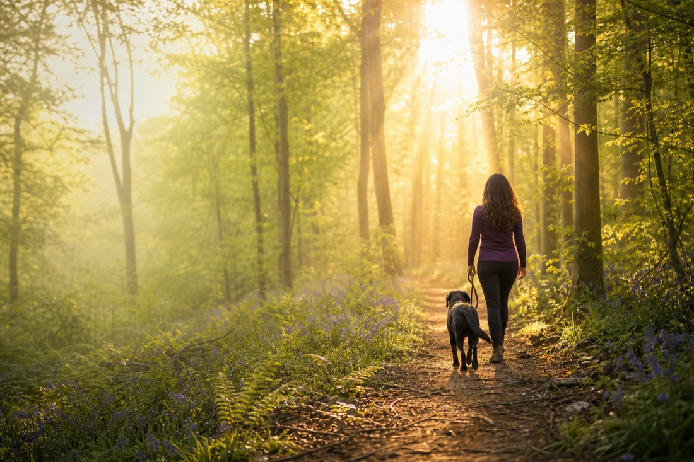
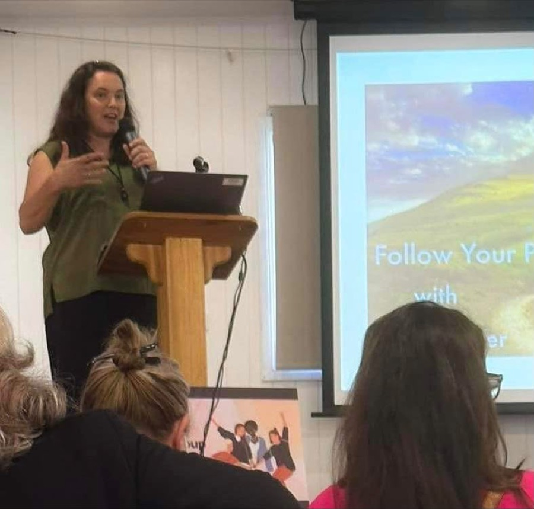

# Opal Life Coaching

A calm, considered marketing website for **Opal Life Coaching** — the practice of Cara Lee, offering life coaching, tarot readings, and Reiki healing in West Sussex and online.

The site is designed to feel warm, unhurried, and personal: soft lilac and mint tones, woodland-inspired details, and spacious layouts that invite visitors to explore at their own pace rather than pushing them toward a sale.

---

## About the site

Opal Life Coaching serves people at crossroads — career changes, life transitions, burnout, or simply the desire for clearer direction. The website reflects that ethos in both copy and design: gentle motion, editorial section layouts, and clear paths to book a session or get in touch without pressure.

**Services covered:**

| Service | Focus |
|---------|--------|
| **Life Coaching** | Clarity, confidence, and practical support through transitions |
| **Tarot Readings** | Reflective guidance and perspective through intuitive card work |
| **Reiki Healing** | Restorative energy healing for balance and calm |

Sessions are available **online or in person** in the Chichester and Eastergate area. A free discovery call is offered for coaching enquiries.

---

## Screenshots

**Homepage** — woodland hero, service overview, and invitation to explore:



**About Cara** — personal storytelling with nature-inspired framing:



---

## Pages

| Route | Purpose |
|-------|---------|
| `/` | Homepage — hero, services, testimonials, FAQs, contact invitation |
| `/about` | Cara's story, credentials, and approach |
| `/coaching` | Life coaching service detail |
| `/tarot` | Tarot readings service detail |
| `/reiki` | Reiki healing service detail |
| `/bookings` | Service picker with Cal.com scheduling embeds |
| `/contact` | Enquiry form with service selection |

Each service page follows a consistent editorial flow: hero → overview → benefits → sessions & pricing → closing invitation.

---

## Project structure

```
OpalLifeCoaching/
├── pages/                      # Routes (Next.js Pages Router)
│   ├── _app.tsx                # Shared shell — header, footer, global styles
│   ├── _document.tsx           # HTML document, font loading
│   ├── index.tsx               # Homepage
│   ├── about.tsx
│   ├── bookings.tsx
│   ├── coaching.tsx
│   ├── contact.tsx
│   ├── reiki.tsx
│   └── tarot.tsx
│
├── components/
│   ├── hero/                   # Page heroes, 3D service visuals, about hero
│   ├── layout/                 # Header, footer, page shell, SEO head
│   ├── pages/                  # Full-page content (service, about, bookings)
│   ├── sections/               # Reusable homepage sections
│   └── ui/                     # Shared primitives (OpalSep, Select, etc.)
│
├── lib/
│   ├── site.ts                 # Site name, email, location, nav links
│   ├── services.ts             # Service page content & booking metadata
│   └── cn.ts                   # Class name utility
│
├── public/
│   └── assets/                 # Images, icons, SVG nature frames
│
├── styles/
│   └── globals.css             # Design tokens, components, responsive rules
│
└── docs/
    └── screenshots/            # README preview images
```

### Key modules

- **`lib/services.ts`** — Single source of truth for service copy, sessions, pricing, SEO metadata, and booking labels. Service pages and the bookings studio both read from here.
- **`components/pages/ServicePageContent.tsx`** — Shared layout for all three service routes.
- **`components/pages/BookingsStudioSection.tsx`** — Tabbed booking interface with Cal.com embed support.
- **`components/pages/ClosingInvitationCta.tsx`** — Shared closing call-to-action used across service, about, and bookings pages.
- **`styles/globals.css`** — Brand tokens, opal/vine border systems, header behaviour, and section styling.

---

## Design language

### Brand feel

Warm, calm, and personal. The visual language blends **opal iridescence** (soft lilac, mint, and peach shifts) with **English woodland nature** (sage greens, ferns, and delicate sprigs). Layouts are spacious; motion is gentle; copy invites rather than pushes.

### Colour palette

| Token | Hex | Use |
|-------|-----|-----|
| `--blue` | `#1C30A3` | Headings, primary text accents, nav links |
| `--pastel-lilac` | `#B3A2FE` | Primary buttons, script accent |
| `--pastel-mint` | `#bce4de` | Gradient accents, trust dots |
| `--pastel-blue` | `#a2bffe` | Secondary tints, tag backgrounds |
| `#9580f5` | — | Eyebrow pills, script on tinted sections |
| `--text` | `#2a2840` | Body copy |
| `--muted` | `#5c5878` | Supporting text |
| `--nature-sage` | `#7aab8e` | Nature accent, icon halos |

Purple-tinted backgrounds signal softer, more intimate sections. White and off-white backgrounds signal clarity and openness.

### Typography

| Role | Font |
|------|------|
| Body | Manrope |
| Headings | Cormorant Garamond |
| Script accent | Sacramento |

### Border treatments

Two complementary systems depending on background context:

- **Opal border** — Iridescent gradient frame for cards and panels on white/light surfaces
- **Vine border** — Botanical SVG frame (`nature-vine-frame.svg`) for panels on lilac or nature-toned sections

The `<OpalSep />` component provides the signature heart divider between section headings and body copy.

---

## Integrations

| Service | Purpose |
|---------|---------|
| **Cal.com** | Live session booking (configured via `NEXT_PUBLIC_CAL_USERNAME`) |
| **Vercel** | Hosting and deployment |

---

## Contact

**Opal Life Coaching** · With Cara  
Chichester & Eastergate, West Sussex  
[hello@opallifecoaching.com](mailto:hello@opallifecoaching.com)
