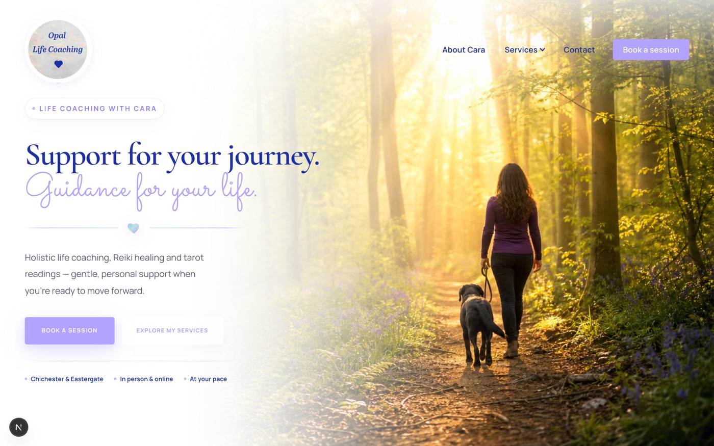
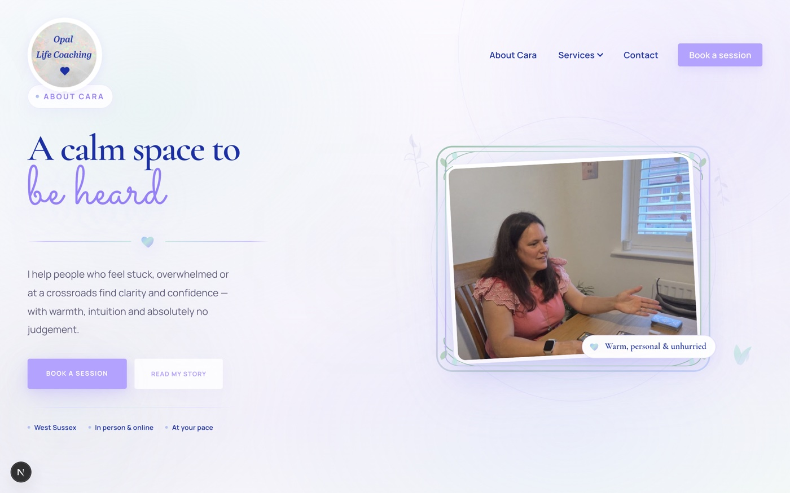

# Opal Life Coaching

A calm, considered marketing website for **Opal Life Coaching** — the practice of Cara Lee, offering life coaching, tarot readings, and Reiki healing in West Sussex and online.

The site is designed to feel warm, unhurried, and personal: soft lilac and mint tones, woodland-inspired details, and spacious layouts that invite visitors to explore at their own pace rather than pushing them toward a sale.

---

## About the site

Opal Life Coaching serves people at crossroads — career changes, life transitions, burnout, or simply the desire for clearer direction. The website reflects that ethos in both copy and design: gentle motion, editorial section layouts, and clear paths to book a session or get in touch without pressure.

**Services covered:**

| Service | Focus |
|---------|--------|
| **Life Coaching** | Clarity, confidence, and practical support through transitions |
| **Tarot Readings** | Reflective guidance and perspective through intuitive card work |
| **Reiki Healing** | Restorative energy healing for balance and calm |

Sessions are available **online or in person** in the Chichester and Eastergate area. A free discovery call is offered for coaching enquiries.

**Live site:** [opal-life-coaching.vercel.app](https://opal-life-coaching.vercel.app)

---

## Built with

| Layer | Technology |
|-------|------------|
| **Framework** | [Next.js 16](https://nextjs.org/) (Pages Router for the site, App Router for the CMS admin) |
| **CMS** | [Payload 3](https://payloadcms.com/) — admin at `/admin`, Postgres ([Neon](https://neon.tech/)) + [Vercel Blob](https://vercel.com/docs/storage/vercel-blob) for media |
| **UI** | [React 19](https://react.dev/) |
| **Language** | [TypeScript 5](https://www.typescriptlang.org/) |
| **Styling** | [Tailwind CSS v4](https://tailwindcss.com/) + custom CSS design tokens |
| **Fonts** | [next/font](https://nextjs.org/docs/pages/building-your-application/optimizing/fonts) — Manrope, Cormorant Garamond, Sacramento |
| **Images** | [next/image](https://nextjs.org/docs/pages/building-your-application/optimizing/images) with AVIF/WebP |
| **Booking** | [Cal.com](https://cal.com/) embed via [`@calcom/embed-react`](https://cal.com/docs/developing/guides/embeds/embed-react) (`NEXT_PUBLIC_CAL_USERNAME`) |
| **Hosting** | [Vercel](https://vercel.com/) |
| **Package manager** | Yarn |

**Notable implementation details:**

- Scroll-triggered entrance animations (`Reveal` + Intersection Observer)
- Smooth FAQ accordion and custom accessible form `<Select>`
- SEO: canonical URLs, Open Graph, Twitter cards, JSON-LD, sitemap, `robots.txt`
- Security headers via `next.config.ts` (CSP-adjacent hardening, frame options, referrer policy)
- Performance: compressed assets, font/image optimisation, Lighthouse-focused polish

---

## Screenshots

**Homepage** — woodland hero, service overview, and invitation to explore:



**About Cara** — personal storytelling with nature-inspired framing:



---

## Pages

| Route | Purpose |
|-------|---------|
| `/` | Homepage — hero, services, testimonials, FAQs, contact invitation |
| `/about` | Cara's story, credentials, and approach |
| `/coaching` | Life coaching service detail |
| `/tarot` | Tarot readings service detail |
| `/reiki` | Reiki healing service detail |
| `/bookings` | Service picker with Cal.com scheduling embeds |
| `/contact` | Enquiry form with service selection |

Each service page follows a consistent editorial flow: hero → overview → benefits → sessions & pricing → closing invitation.

---

## Project structure

```
OpalLifeCoaching/
├── app/(payload)/              # Payload admin (/admin) + REST/GraphQL API (/api) — generated, App Router
├── payload.config.ts           # Payload config: database, storage, collections, globals
├── payload/
│   ├── collections/            # Services, Testimonials, FAQs, Media, Users
│   ├── globals/                # Home, About, Contact & FAQs, Service page sections, Closing invitation, Header & footer, Site settings
│   ├── fields/                 # Shared field helpers (links, headings, SEO…)
│   ├── hooks/revalidateSite.ts # Refreshes the static pages after every content change
│   └── seed/                   # Original site copy + `yarn seed` script
├── migrations/                 # Payload database migrations (run on deploy)
├── payload-types.ts            # Generated types (`yarn generate:types`)
│
├── pages/                      # Routes (Next.js Pages Router) — content via getStaticProps
│   ├── _app.tsx                # Shared shell — header, footer, CMS layout context
│   ├── _document.tsx           # HTML document, font loading
│   ├── index.tsx               # Homepage
│   ├── about.tsx
│   ├── bookings.tsx            # Content not in Payload yet (header/footer only)
│   ├── coaching.tsx / tarot.tsx / reiki.tsx
│   ├── contact.tsx
│   ├── 404.tsx + [...slug].tsx # Branded 404 page
│   └── api/revalidate.ts       # On-demand ISR endpoint called by Payload hooks
│
├── components/
│   ├── hero/                   # Page heroes, 3D service visuals, about hero
│   ├── layout/                 # Header, footer, page shell, SEO head
│   ├── pages/                  # Full-page content (service, about, bookings)
│   ├── sections/               # Reusable homepage sections
│   └── ui/                     # Shared primitives (OpalSep, Select, etc.)
│
├── lib/
│   ├── cms.ts                  # Server-only Payload fetchers used by getStaticProps
│   ├── cms-types.ts            # Client-safe CMS types and helpers
│   ├── revalidation.ts         # Route list + token for on-demand revalidation
│   ├── site.ts                 # Build-time config (site URL, search indexing flag)
│   └── cn.ts                   # Class name utility
│
├── public/
│   └── assets/                 # Images, icons, SVG nature frames
│
├── styles/
│   └── globals.css             # Design tokens, components, responsive rules
│
└── docs/
    └── screenshots/            # README preview images (see scripts/capture-readme-screenshots.mjs)
```

### Key modules

- **Payload CMS** — all page copy, services, testimonials, FAQs, navigation and photos are edited at `/admin` (see [Content management](#content-management)).
- **`lib/cms.ts`** — Loads Payload content through the Local API inside `getStaticProps`.
- **`components/pages/ServicePageContent.tsx`** — Shared layout for all three service routes.
- **`components/pages/BookingsStudioSection.tsx`** — Session grid grouped by service, with per-event Cal.com booking embeds.
- **`components/pages/ClosingInvitationCta.tsx`** — Shared closing call-to-action used across service, about, and bookings pages.
- **`styles/globals.css`** — Brand tokens, opal/vine border systems, header behaviour, and section styling.

---

## Design language

### Brand feel

Warm, calm, and personal. The visual language blends **opal iridescence** (soft lilac, mint, and peach shifts) with **English woodland nature** (sage greens, ferns, and delicate sprigs). Layouts are spacious; motion is gentle; copy invites rather than pushes.

### Colour palette

| Token | Hex | Use |
|-------|-----|-----|
| `--blue` | `#1C30A3` | Headings, primary text accents, nav links |
| `--pastel-lilac` | `#B3A2FE` | Primary buttons, script accent |
| `--pastel-mint` | `#bce4de` | Gradient accents, trust dots |
| `--pastel-blue` | `#a2bffe` | Secondary tints, tag backgrounds |
| `#9580f5` | — | Eyebrow pills, script on tinted sections |
| `--text` | `#2a2840` | Body copy |
| `--muted` | `#5c5878` | Supporting text |
| `--nature-sage` | `#7aab8e` | Nature accent, icon halos |

Purple-tinted backgrounds signal softer, more intimate sections. White and off-white backgrounds signal clarity and openness.

### Typography

| Role | Font |
|------|------|
| Body | Manrope |
| Headings | Cormorant Garamond |
| Script accent | Sacramento |

### Border treatments

Two complementary systems depending on background context:

- **Opal border** — Iridescent gradient frame for cards and panels on white/light surfaces
- **Vine border** — Botanical SVG frame (`nature-vine-frame.svg`) for panels on lilac or nature-toned sections

The `<OpalSep />` component provides the signature heart divider between section headings and body copy.

---

## Content management

Site content lives in [Payload CMS](https://payloadcms.com/), served from the same Next.js app at **`/admin`**.

| Admin section | What it controls |
|---|---|
| **Pages → Home / About / Contact** | Copy, buttons, highlights and photos for each page |
| **Pages → Life Coaching / Tarot / Reiki** | Each service's page, card, menu entry, photo and SEO |
| **Components → Header / Footer** | Navigation, Services dropdown, footer copy and links |
| **Components → Closing invitation / Service page layout** | Shared sections used on several pages |
| **Components → Testimonials / FAQs** | Home page quotes (first three shown) and the FAQ list (drag to reorder) |
| **Library → Photos** | Uploaded photos and service icons |
| **Settings → Site settings / Admin users** | Email, social links, default SEO and who can sign in |

The sidebar is custom (`payload/admin/navItems.ts`); Payload's default groups are hidden with `admin.group: false`.

**Live preview** opens beside every editor and updates as you type (`payload/livePreview.ts` picks what to show; `lib/useLivePreviewProps.ts` applies unsaved edits). Pages scroll to the section being edited (`payload/admin/PreviewSectionSync.tsx`); shared components are shown on their own via `pages/preview/[component].tsx`. The admin is themed to match the site — see `app/(payload)/custom.scss` and `payload/admin/`.

Pages are statically generated. Saving anything in the admin calls `pages/api/revalidate.ts`, which regenerates every public page, so changes are live within a few seconds. Decorative artwork (sprigs, vines, hearts, value icons) stays in `public/assets` as part of the design.

### Environment variables

| Variable | Purpose |
|---|---|
| `DATABASE_URL` | Neon Postgres connection string (added by the Vercel Neon integration) |
| `PAYLOAD_SECRET` | Long random string for signing admin sessions (`openssl rand -hex 32`) |
| `BLOB_READ_WRITE_TOKEN` | Vercel Blob token for media uploads (added when a Blob store is connected). Without it, uploads are stored in `./media` locally |
| `VERCEL_AUTOMATION_BYPASS_SECRET` | Optional — lets revalidation reach protected preview deployments |

### First-time setup

```bash
vercel env pull .env.local   # DATABASE_URL, BLOB_READ_WRITE_TOKEN, PAYLOAD_SECRET
yarn dev                     # creates the schema in the dev database automatically
yarn seed                    # loads the original site copy and photos (safe to re-run; `yarn seed --force` overwrites)
```

Then open `http://localhost:3000/admin` and create the first admin user.

### Schema changes

Local development pushes schema changes automatically. Before deploying a change to collections or globals, create a migration and commit it — `yarn build` runs `payload migrate` before `next build` on Vercel:

```bash
yarn payload migrate:create <name>
yarn generate:types
```

Use a separate Neon branch for local development so dev schema pushes never touch production.

---

## Integrations

| Service | Purpose |
|---------|---------|
| **Payload CMS** | Content editing at `/admin` |
| **Neon** | Postgres database for Payload |
| **Vercel Blob** | Media storage for Payload uploads |
| **Cal.com** | Live session booking (configured via `NEXT_PUBLIC_CAL_USERNAME`) |
| **Vercel** | Hosting and deployment |

---

## Contact

**Opal Life Coaching** · With Cara  
Chichester & Eastergate, West Sussex  
[hello@opallifecoaching.com](mailto:hello@opallifecoaching.com)
